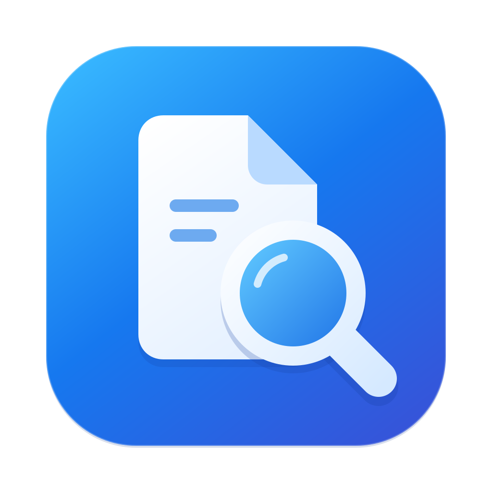

<p align="center">
  
</p>
<h1 align="center">APFSearch</h1>
<p align="center"><strong>为 macOS 打造的本地文件搜索工具。</strong><br>All-Purpose File Search</p>
<p align="center"><code>macOS 14+</code> &nbsp; <code>Apple Silicon + Intel</code> &nbsp; <code>Swift + Rust</code> &nbsp; <a href="LICENSE">MIT 开源</a></p>
<p align="center"><a href="README.md">English</a> · <strong>简体中文</strong></p>
<p align="center"><a href="#功能">功能</a> · <a href="#下载">下载</a> · <a href="#开始使用">开始使用</a> · <a href="#搜索">搜索</a> · <a href="#文档">文档</a></p>

---

APFSearch 通过 AppKit 界面和共享服务的命令行客户端，提供文件名、路径和元数据搜索。它针对 APFS 独立建立索引，不依赖 Spotlight。

> **开发中。** 当前版本尚不能完整替代 Everything，也与 voidtools 无关联。整卷正确性、实际使用延迟、高级语法兼容性和最低系统版本的实机兼容性仍需验证，详见[当前限制](#当前限制)。

## 功能

| 查找文件 | 处理结果 |
| :--- | :--- |
| **灵活的查询语法**<br>组合文件名、路径、扩展名、大小、日期、布尔条件和正则表达式。 | **熟悉的操作方式**<br>原生结果表格、标签页、快捷键、快速查看和 Finder 操作。 |
| **独立索引**<br>APFS 遍历、文件变更增量监听，以及明确可见的未覆盖位置。 | **可检查的文件操作**<br>重命名、复制、移动和移入废纸篓，提供冲突预览与操作记录。 |
| **不止文件名**<br>按需提取内容、读取图像与媒体属性、检查重复内容，并支持离线文件列表。 | **多语言界面**<br>通过原生 String Catalogs 支持英语、简繁中文、日语、韩语、俄语、西班牙语和葡萄牙语。 |

## 下载

**[v0.1.0 预发布](https://github.com/JamesLinYJ/APFSearch/releases/tag/v0.1.0)** · macOS 14 及以上

| 你的 Mac | 下载 |
| :--- | :--- |
| 通用版（两种芯片） | [DMG](https://github.com/JamesLinYJ/APFSearch/releases/download/v0.1.0/APFSearch-0.1.0-Universal.dmg) · [ZIP](https://github.com/JamesLinYJ/APFSearch/releases/download/v0.1.0/APFSearch-0.1.0-Universal.zip) |
| Apple Silicon（M 系列） | [DMG](https://github.com/JamesLinYJ/APFSearch/releases/download/v0.1.0/APFSearch-0.1.0-AppleSilicon.dmg) · [ZIP](https://github.com/JamesLinYJ/APFSearch/releases/download/v0.1.0/APFSearch-0.1.0-AppleSilicon.zip) |
| Intel Mac | [DMG](https://github.com/JamesLinYJ/APFSearch/releases/download/v0.1.0/APFSearch-0.1.0-Intel.dmg) · [ZIP](https://github.com/JamesLinYJ/APFSearch/releases/download/v0.1.0/APFSearch-0.1.0-Intel.zip) |

不确定芯片类型时选通用版。打开 DMG 后，将 APFSearch 拖入 Applications 文件夹；ZIP 适合手动部署。各包内的应用均使用 Developer ID 签名并附有 Apple 公证票据，DMG 容器未单独公证。[SHA-256 校验值](https://github.com/JamesLinYJ/APFSearch/releases/download/v0.1.0/SHA256SUMS.txt)。

这是开发预览版。Intel 代码已通过 Rosetta 运行检查；真实 Intel 硬件及 macOS 14 仍需实机验证。

## 开始使用

### 从源码构建

请使用 **Rust 稳定版工具链**与包含 macOS SDK、Swift 编译器和 `xcstringstool` 的 **Xcode** 从源码构建，默认生成适用于 macOS 14 及以上的通用应用（`arm64` + `x86_64`）。

```sh
# 首次构建前安装两种 macOS 编译目标。
rustup target add aarch64-apple-darwin x86_64-apple-darwin

# 编译应用、服务和 CLI，不签名、不安装。
APFSEARCH_COMPILE_ONLY=1 ./build.sh
```

产物位于 `/private/tmp/APFSearch-build/APFSearch.app`，可通过 `APFSEARCH_BUILD_DIR` 更改输出目录。SQLite 和 PCRE2 静态链接；Cargo 使用 `core/Cargo.lock` 中锁定的依赖。

应用、索引服务和 CLI 均包含两种架构。日常开发时，可设置 `APFSEARCH_ARCHITECTURES=arm64` 或 `APFSEARCH_ARCHITECTURES=x86_64` 以缩短编译时间。Rust 构建、Swift 编译器、应用元数据和测试包通过 `scripts/build_configuration.py` 共享最低系统版本。安装了多份 Xcode 时，可通过 `DEVELOPER_DIR` 指定工具链。

**要运行经过身份验证的后台服务**，请使用自己的 Apple Developer 签名身份构建：

```sh
APFSEARCH_SIGN_IDENTITY='Developer ID Application: Your Name (TEAMID)' ./build.sh
```

应用、CLI 和服务必须使用同一受信任团队的签名。未签名或 ad-hoc 签名的构建仅用于编译验证，不能使用正式 XPC 服务。签名配置不保存在仓库中。

1. 将签名后的 `APFSearch.app` 复制到 `/Applications` 并打开。
2. 选择要索引的文件夹或本机 APFS 卷。
3. 如有提示，在**系统设置 → 通用 → 登录项**中允许后台活动；仅在所选范围需要时授予**完全磁盘访问权限**。

索引无需 root、内核扩展或关闭 SIP。云端占位文件不会被自动下载。界面以英语兜底，数字和日期格式则独立遵循系统地区设置。

## 搜索

| 查询 | 用途 |
| :--- | :--- |
| `invoice` | 查找名称包含 “invoice” 的文件 |
| `ext:pdf;docx` | 查找 PDF 和 Word 文件 |
| `size:>10mb dm:today` | 查找今天修改且大于 10 MB 的文件 |
| `path:Documents` | 匹配文件路径 |
| `"annual report" \| invoice` | 匹配短语或 “invoice” |
| `regex:^report[0-9]+` | 使用正则表达式匹配 |
| `content:"keyword"` | 搜索受支持文件的内容，可能需要更长时间 |

空格表示**且（AND）**，`|` 表示**或（OR）**，`!` 表示排除。内容提取支持文本／代码、PDF 和 Office Open XML 文件；不支持的格式和无法读取的文件会明确报告。

| 快捷键 | 操作 |
| :--- | :--- |
| 选中结果后按 `空格` | 快速查看 |
| `Return` | 打开 |
| `⌘⇧C` | 复制路径 |
| `⌘D` | 将当前搜索存为书签 |
| `⇧` + 点击列标题 | 增加排序列 |

CLI 使用相同的搜索服务：

```sh
/Applications/APFSearch.app/Contents/MacOS/apfsearch-cli status
/Applications/APFSearch.app/Contents/MacOS/apfsearch-cli search 'ext:pdf size:>1mb'
```

<details>
<summary><strong>索引如何工作</strong></summary>

| 层次 | 职责 |
| :--- | :--- |
| Swift / AppKit | 搜索窗口、结果表格、菜单、快速查看和文件操作 |
| SwiftUI | 偏好设置、筛选器、书签和索引范围 |
| Rust | APFS 遍历、事件核对、查询解析、过滤和排序 |
| SQLite WAL | 元数据、偏好设置、内容与事件进度的持久化依据 |
| 派生缓存 | 可重建的搜索列、倒排、排序信息和不可变快照 |

APFS 遍历使用 `getattrlistbulk`。FSEvents 在首次遍历前启动，收到事件后核对文件系统现状。硬链接保留每个目录项，目录符号链接默认不递归跟随，无法访问的位置会出现在覆盖报告中。

搜索使用子串候选过滤、Roaring 位图、数值列、Unicode 规范化和大小写折叠，以及 PCRE2 正则表达式。每个查询绑定一个快照版本；内容提取和哈希计算独立调度并支持取消。

Bundle 标识为 `org.apfsearch.app`、`org.apfsearch.indexer` 和 `org.apfsearch.cli`；Rust 包名为 `apfsearch-core`。

配置归属于新的应用标识，索引位于 `~/Library/Application Support/APFSearch`。本版按全新应用启动，不导入早期开发版本的配置或索引。

</details>

## 当前限制

- **兼容性：** Everything 1.5 的语法、属性函数、重复文件处理和高级批量操作尚未完全对齐，不支持的函数应明确报错。
- **启动与性能：** 缓存日志溢出或历史失效可能需要从 SQLite 恢复，导致启动变慢。部分快照与排序工作量仍随索引规模增长，整机延迟和磁盘活动需要持续实测。
- **文件操作：** 单次批量操作最多 100,000 项。快速查看和开始拖放要求相关行已加载；无法解析的选择不会被静默执行为部分文件操作。
- **重复内容：** 内容相同不能证明 APFS 克隆关系，也不能直接计算可回收空间。在证据充分时会区分硬链接和独立存储的相同内容文件。
- **验收：** 授权范围内的完整遍历对照、真实负载下的崩溃／事件丢失恢复，以及最终安装版界面行为尚未全部验收。最初设定的性能目标也未全部验证。以 macOS 14 为编译目标、通过 Rosetta 运行 Intel 代码，不能替代真实 Intel Mac 或 macOS 14 的测试。
- **分发：** 默认源码构建用于编译验证。正式分发需要对实际交付产物完成签名和公证，详见[分发指南](docs/DISTRIBUTION.md)。

运行数据保存在 `~/Library/Application Support/APFSearch`。卸载前请注销后台服务并关闭登录启动；如需保留索引和设置，可保留此数据目录。

## 文档

| 指南 | 内容 |
| :--- | :--- |
| [核心接口](core/README.md) | 搜索引擎请求与数据模型 |
| [增量索引](docs/INCREMENTAL_INDEX.md) | 缓存恢复与增量发布 |
| [工作流程细节](docs/WORKFLOWS.md) | 文件操作检查、查询快照租约和更新生命周期 |
| [本地化](docs/LOCALIZATION.md) | 稳定标识、原生语言选择和验证 |
| [图标与标志](Resources/Brand/README.md) | 可编辑 SVG、单色标志和 ICNS 生成 |
| [分发](docs/DISTRIBUTION.md) | Xcode 账号上传、公证和交付产物验证 |
| [贡献指南](AGENTS.md) | 架构、验证、隐私和代码规范 |

<details>
<summary><strong>运行验证</strong></summary>

```sh
cargo fmt --manifest-path core/Cargo.toml --check
PCRE2_SYS_STATIC=1 MACOSX_DEPLOYMENT_TARGET=14.0 cargo test --locked --manifest-path core/Cargo.toml
./tests/run.sh
python3 tests/run_search_window_tests.py --report validation/search-window.json
python3 tests/run_feature_tests.py
python3 tests/check_localization.py
```

测试使用隔离样本。界面测试需要 WindowServer；控制器测试不能替代前台动画和输入法验证。大型合成测试与实际索引基准需主动启用。验证报告可能包含本地路径，因此不会提交到 Git。

CI 直接构建和测试已提交的源码，不依赖生成源码的补丁或自动提交。请勿提交本地索引、日志、文件列表和签名材料。`CLAUDE.md` 链接到 `AGENTS.md`。

</details>

## 许可证

原创代码与图标采用 [MIT 许可证](LICENSE)。再分发时须保留相应版权和许可声明；软件不提供担保。依赖项仍遵循各自许可证，详见 [THIRD_PARTY_NOTICES.txt](THIRD_PARTY_NOTICES.txt)。
